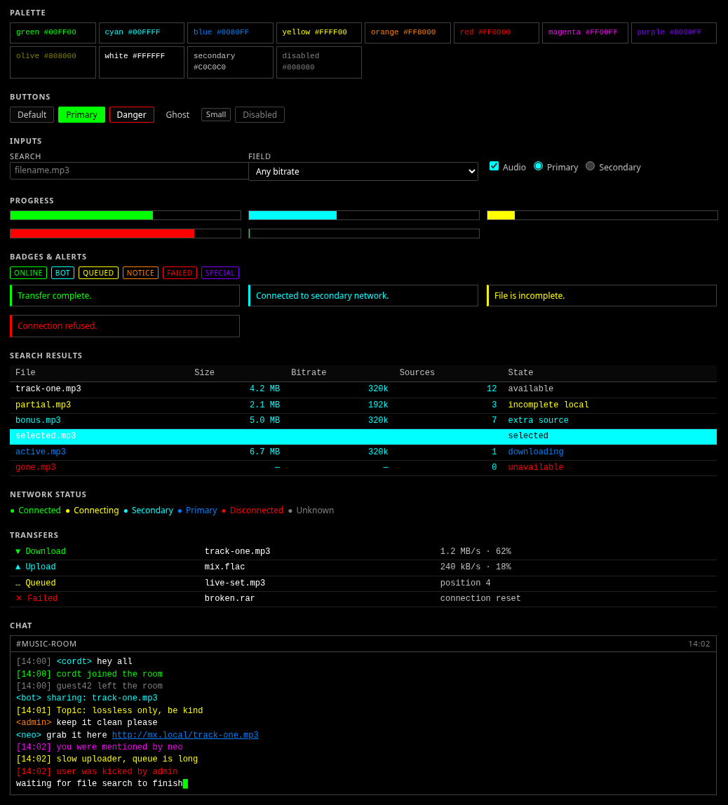
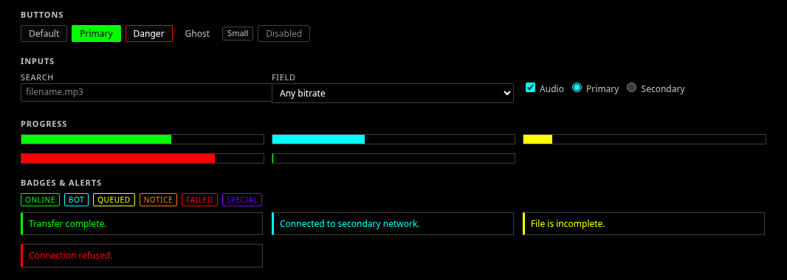
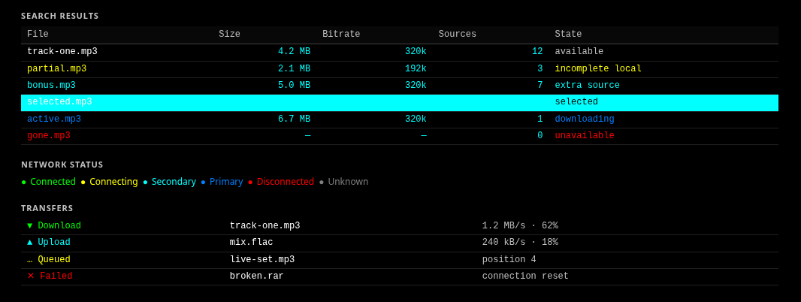
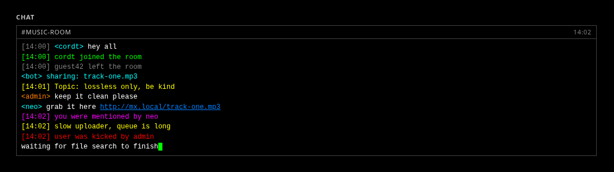

# WinMX Theme Kit

A drop-in dark/neon theme and UI element kit modelled on the classic **WinMX**
look: pure black content areas, near-white text, and fully saturated colors
reserved for *information* — never decoration.

- No build step, no runtime dependency.
- Works with plain CSS, Tailwind CSS v3/v4, and PandaCSS / park-ui.
- Compact controls, 1px borders, square-ish corners, monospace data.



## Screenshots

| Controls | Search results & transfers | Chat |
| --- | --- | --- |
|  |  |  |

```
src/winmx.css            core tokens + element/component classes
tailwind/winmx-theme.css Tailwind v4 @theme adapter
tailwind/winmx-preset.cjs Tailwind v3 preset
panda/winmx-preset.ts    PandaCSS preset (tokens + recipes + globalCss)
react/index.tsx          optional React components (thin .mx-* wrappers)
tokens.json              canonical palette source (guarded by `npm test`)
demo/index.html          every element, rendered
```

## Drop-in

**Plain CSS / any framework**

```html
<link rel="stylesheet" href="winmx-theme-kit/winmx.css" />
<div class="mx-app"> ... </div>
```

Add `mx-app` to your root container. It sets the black background, white text,
selection and scrollbar styling. Nothing touches bare elements outside it.

**Tailwind v4**

```css
/* your entry css */
@import "winmx-theme-kit/tailwind/theme";
```

Then use `bg-mx-panel`, `text-mx-cyan`, `border-mx-border`, `font-mx-mono`, etc.

**Tailwind v3**

```js
const winmx = require("winmx-theme-kit/tailwind/preset");
module.exports = { presets: [winmx], content: ["./src/**/*.{ts,tsx,html}"] };
```

**PandaCSS / park-ui**

```ts
import { winmxPreset } from "winmx-theme-kit/panda/preset";
export default defineConfig({ presets: [winmxPreset], /* ... */ });
```

Adds `colors.mx.*`, `fonts.mx-ui` / `mx-mono`, `radii.mx`, plus `button`,
`badge` and `progress` recipes. park-ui components pick up the tokens
automatically.

**React (optional)**

Components are thin wrappers over the same classes — no styles live in JS, so
you can mix them with plain classes freely. Requires the CSS plus a `.mx-app`
ancestor.

```tsx
import { WinMXApp, Button, Input, Panel, PanelHeader, PanelBody,
         Progress, Badge, Alert, Status, Chat, ChatMessage } from "winmx-theme-kit/react";

<WinMXApp>
  <Panel>
    <PanelHeader>Search</PanelHeader>
    <PanelBody>
      <Input placeholder="filename.mp3" />
      <Button tone="primary">Search</Button>
      <Progress value={62} tone="cyan" />
      <Status state="connected" />
    </PanelBody>
  </Panel>
</WinMXApp>
```

Exports: `WinMXApp`, `Button`, `Input`, `Textarea`, `Select`, `Label`,
`Checkbox`, `Panel`/`PanelHeader`/`PanelBody`, `Progress`, `Badge`, `Alert`,
`Status`, `Divider`, `Table`/`THead`/`TBody`/`Tr`/`Th`/`Td`, `Chat`/`ChatMessage`,
plus the `cn` helper. TSX source; Vite/Next handle it (Next: add the package to
`transpilePackages`). React `>=18` is an optional peer dependency.

**Using it as the only theme**

- Wrap the app once in `.mx-app` / `<WinMXApp>` and the black base, selection
  and scrollbars are done.
- Tailwind v4: keep `@import ".../tailwind/theme"`; if you want *only* these
  colors, clear the defaults first with `--color-*: initial;` inside `@theme`.
- PandaCSS: the preset's `globalCss` already themes `body`; no extra work.
- The kit never restyles bare elements outside `.mx-app`, so it drops cleanly
  into an app that already has its own theme.

## Palette

| Token | Hex | Role |
| --- | --- | --- |
| `mx.black` / `mx.bg` | `#000000` | Application + content background |
| `mx.panel` | `#080808` | Secondary surface |
| `mx.border` / `mx.border.subtle` | `#404040` / `#202020` | Structure |
| `mx.hover` | `#001010` | Row hover |
| `mx.text` / `.secondary` / `.disabled` | `#FFFFFF` / `#C0C0C0` / `#808080` | Text hierarchy |
| `mx.green` | `#00FF00` | success, active, available, system |
| `mx.cyan` | `#00FFFF` | links/usrnames, info, secondary connection |
| `mx.blue` | `#0080FF` | primary connection, URLs, downloading |
| `mx.yellow` | `#FFFF00` | warnings, queued, incomplete |
| `mx.orange` | `#FF8000` | notices, admin/moderator |
| `mx.red` | `#FF0000` | errors, unavailable, disconnected |
| `mx.magenta` | `#FF00FF` | mentions / highlights |
| `mx.purple` | `#8000FF` | special file/search state |
| `mx.olive` | `#808000` | legacy status |

## Components

- **Buttons** — `.mx-btn`, `--primary`, `--danger`, `--ghost`, `--sm`
- **Inputs** — `.mx-input`, `.mx-select`, `.mx-textarea`, `.mx-label`
- **Panels** — `.mx-panel`, `.mx-panel__header`, `.mx-panel__body`
- **Tables** — `.mx-table` (+ `is-selected` rows, `.mx-file`, `.mx-size`, `.mx-bitrate`, `.mx-sources`, `.mx-meta`, `.mx-num`)
- **Search** — `.mx-result--incomplete|extrasource|downloading|unavailable`
- **Progress** — `.mx-progress` + `__fill`, `--cyan|yellow|red`, `--indeterminate`
- **Status** — `.mx-status--connected|connecting|secondary|primary|disconnected|unknown`
- **Transfers** — `.mx-xfer--download|upload|queued|connecting|paused|complete|failed`
- **Chat** — `.mx-chat`, `.mx-msg--user|system|join|warning|error|link|mention|time|topic|bot|admin`, blinking `.mx-cursor`
- **Badges/alerts** — `.mx-badge--*`, `.mx-alert--success|info|warning|notice|danger`
- **Helpers** — `.mx-text-*`, `.mx-mono`, `.mx-bevel`, `.mx-divider`

See `demo/index.html` for each in context.

## Rules of the look

1. `#000000` means `#000000` — not `#0d1117`.
2. Neon stays fully saturated (`#00FF00`, not `#4ade80`).
3. Most text stays white; neon marks *information* only.
4. Gray is restrained: black → structure → metadata → white → semantic neon.
5. Compact, 1px borders, near-square corners, dense tables, monospace data.

## Checks

```
npm test   # verifies no palette drift across the three adapters
```
